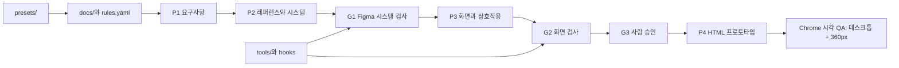

# 범용 디자인 하네스

## 제품 설명

새 프로젝트에 복사해 `rules.yaml`과 `docs/`를 채우면, Claude Code 또는 Codex가 PRD부터 디자인 시스템·화면·HTML 프로토타입까지 일관된 단계와 게이트로 만드는 템플릿입니다.

## 주요 기능

- P1 → P2 → G1 → P3 → G2 → G3 → P4 흐름과 재시도 규칙
- 모바일·웹 프리셋, 공통 컴포넌트·토큰·화면 기준
- Figma 덤프와 G1/G2 기계 게이트 및 요약 번들
- `rules.yaml` 승인 잠금과 단계별 도구 보호 훅
- P4에서 데스크톱·360px 화면을 캡처해 Figma와 비교하는 시각 QA

## 기술 스택

- Node.js ES modules
- YAML 파서, esbuild, Node 내장 테스트 러너
- Figma MCP, Claude Code hooks, 헤드리스 Chrome

## 아키텍처



게이트 판정은 Figma에서 `tools/build-figma-gate.mjs`가 만든 번들을 실행합니다. 번들은 덤프와 평가를 내부에서 수행하고 요약만 반환해 Figma 응답을 20KB 안으로 제한합니다.

## 사전 요구사항

- Node.js 20 이상
- Figma 데스크톱 또는 Figma MCP 연결
- 헤드리스 Chrome 실행 환경(예: Playwright와 Chromium)
- Claude Code 또는 Codex

## 시작

1. 저장소 폴더를 새 프로젝트로 복사하고 사용할 프리셋을 고릅니다.
2. `rules.yaml`과 `docs/prd.md`, `docs/story-service.md`, `docs/design.md`를 프로젝트 내용으로 채웁니다. `rules.yaml` 수정은 사람 승인 후 루트에 `.rules-unlock` 파일을 만들어 허용합니다.
3. `cd tools && npm install && npm test`로 도구를 준비하고 `CLAUDE.md` 또는 `AGENTS.md`의 지시에 따라 P1부터 진행합니다.

도구만 최신 템플릿으로 갱신할 때는 `npx degit doyeonjeong/HCC4-DH/tools tools --force`를 사용합니다.

## 명령어

| 위치 | 명령 | 설명 |
| --- | --- | --- |
| `tools/` | `npm install` | 도구 의존성 설치 |
| `tools/` | `npm test` | 전체 단위 테스트 실행 |
| 저장소 루트 | `node tools/check-sync.mjs` | 디자인 문서와 규칙 동기화 검사 |
| 저장소 루트 | `node tools/check-sync.mjs --preset web` | 웹 프리셋으로 동기화 검사 (규칙 파일은 변경하지 않음) |
| 저장소 루트 | `node tools/build-figma-gate.mjs --gate G1` | G1 Figma 실행 번들 생성 |
| 저장소 루트 | `node tools/build-figma-gate.mjs --gate G2` | G2 Figma 실행 번들 생성 |
| 저장소 루트 | `node tools/check-gates.mjs --gate G1 --dump <dump.json> --out runs/<id>/G1.json` | 덤프 파일로 게이트 평가·디버깅 |

## 프로젝트 구조

```text
.
├── AGENTS.md / CLAUDE.md       # Codex와 Claude Code 공통 실행 규칙
├── .claude/settings.json       # Claude Code 보호 훅
├── docs/                       # 프로젝트 PRD·서비스 규칙·디자인 기준
├── examples/huddling/          # 기존 Huddling PoC 보존본
├── harness/                    # R2~R7 실행 규칙
├── presets/                    # mobile.yaml, web.yaml
├── rules.yaml                  # 프로젝트 게이트 기준 SSOT
├── state.json                  # 현재 단계와 게이트 상태 양식
├── runs/                       # 실행별 산출물
└── tools/                      # 덤프·평가·동기화·훅·테스트
```

## 참고 사항

- 게이트는 구조와 수치 기준을 확인합니다. 미감은 G3 사람 승인과 P4 시각 QA에서 확인합니다.
- Figma MCP 호출은 프로젝트당 약 15~20회가 기준이며, 복잡한 흐름은 더 필요할 수 있습니다.
- 시각 QA는 화면별 데스크톱 폭과 360px 폭을 캡처해 Figma 기준과 비교하고 결함 표를 남깁니다.
- 테스트 픽스처는 범용 가짜 데이터만 사용합니다. 실제 프로젝트 화면·문구·파일 키를 테스트 데이터에 넣지 않습니다.
